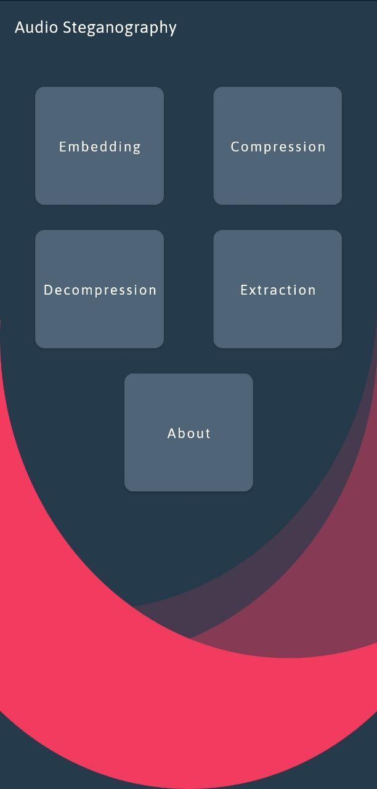
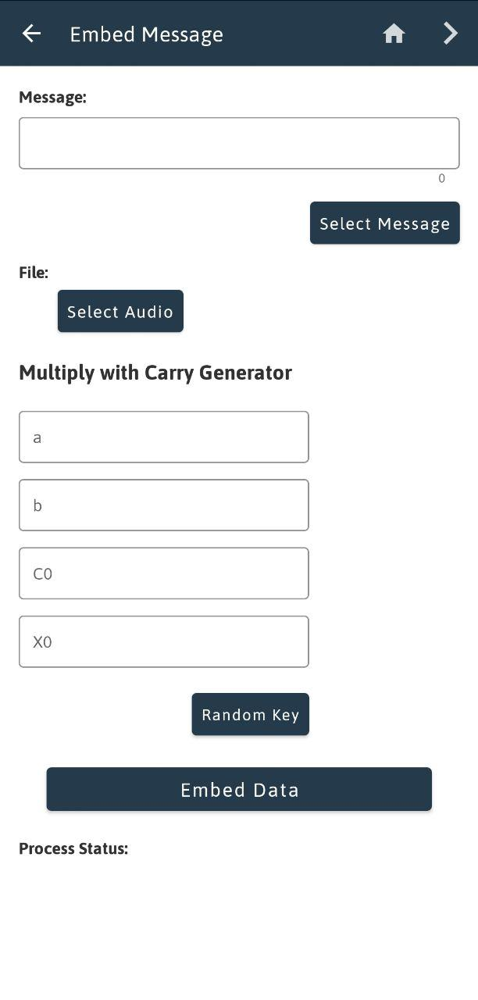
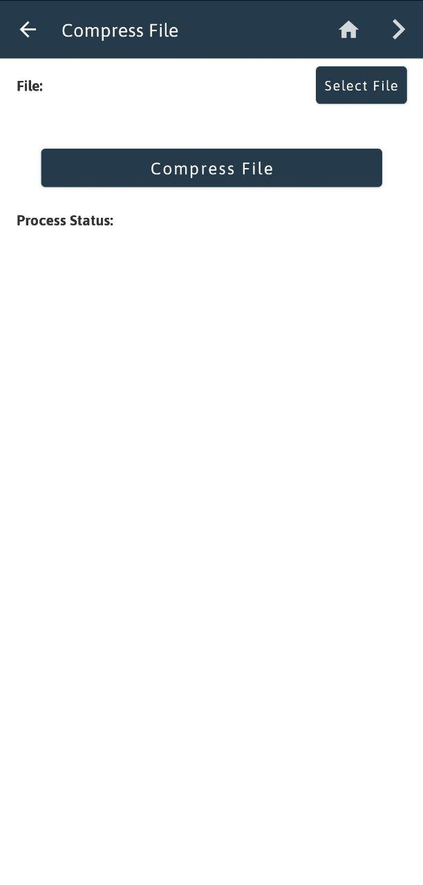
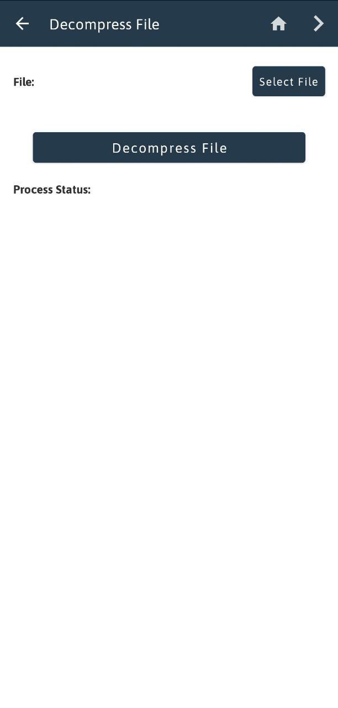
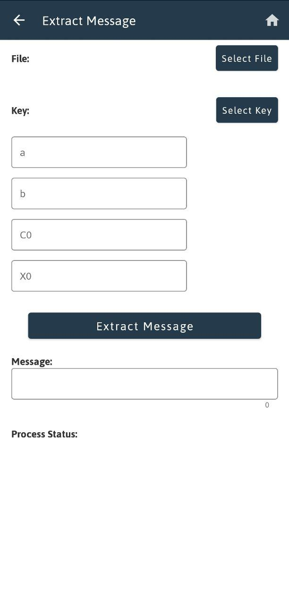
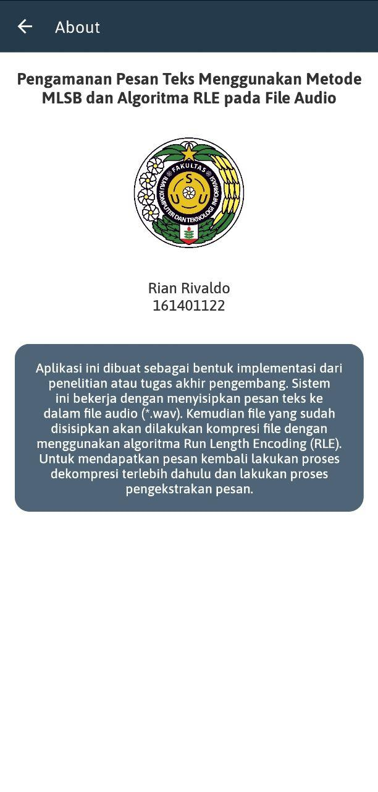

# Audio Steganography

Undergraduate Thesis entitled **SECURING MESSAGES USING MLSB PRNG METHOD AND FILE COMPRESSION WITH RLE ALGORITHM ON AUDIO FILES** which is implemented using an android application.

## Abstract

Data security can be a serious problem, especially if the data contains confidential information. In overcoming this problem, Modified Least Significant Bit algorithm as one of steganography technique is used, where the determination of the embedding index is based on random numbers generated by the Pseudo-Random Number Generator with the Multiply with Carry algorithm. In addition to the security, data size is also an important factor in data transmission. The larger the size the more time it will take to transmit the data. Therefore, the Run Length Encoding algorithm is needed to compress the data size, which will shorten the time to transmit the data. In the message extraction process, a stego key is needed to generate random numbers. Based on the testing of extraction process with an arbitrary key, it is obtained that the message tested is not the original message that has been embedded previously. In the results of the embedding and extraction process, it is obtained that the average value of PSNR is 63.61498 dB, which means the quality of the stego object produced is quite good with an average running time of both of them at 2.68551 seconds and 2.93246 seconds. Whereas the measurement of file compression performance results with an average value of Compression Ratio at 1.00113, Space Savings at 0.1133%, and Bitrate at 584025.33 bits/sample. These results indicate that RLE algorithm compression is not efficient to compress file sizes with an average of compression and decompression running times of 2.24571 seconds and 1.9175 seconds respectively. After implementation, it is also known that the complexity of the Modified Least Significant Bit algorithm is Θ(n^2) where n is the number of message bits to be embedded. In addition, the complexity of the Run Length Encoding algorithm is Θ(nm) where n is the stego object bytes and m is the number of bytes rewritten on the compressed file.

## Screenshot

